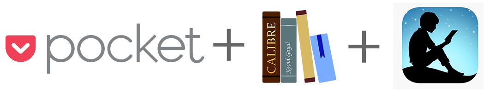
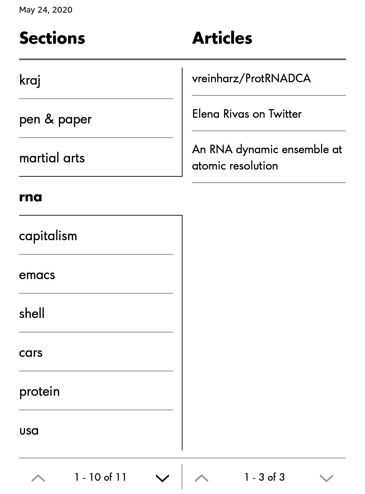
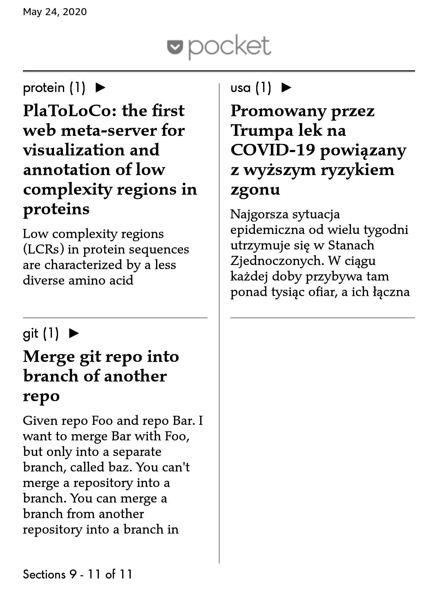
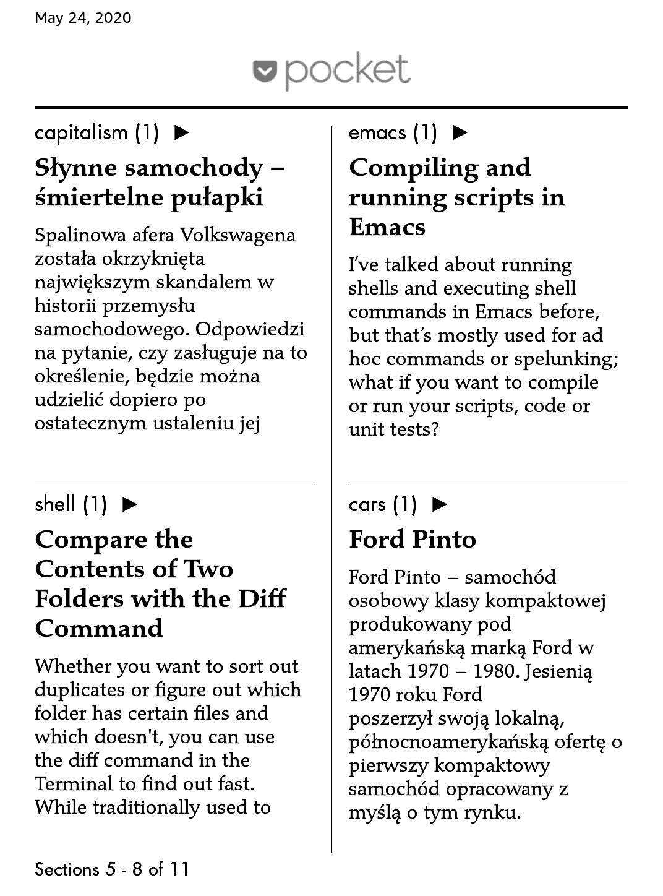
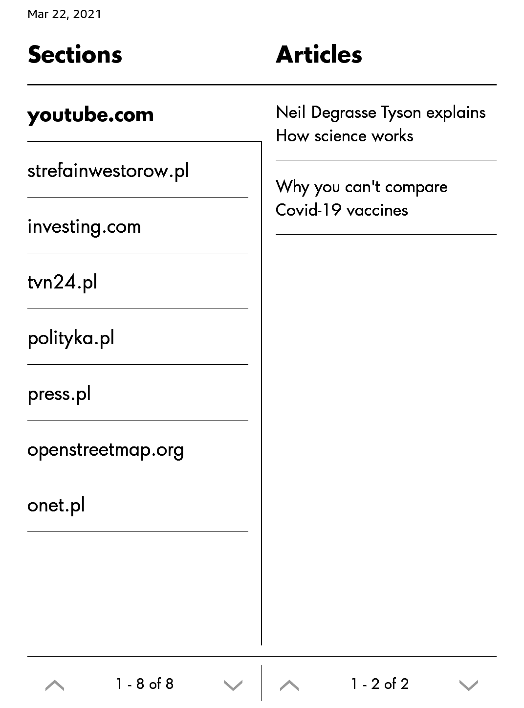
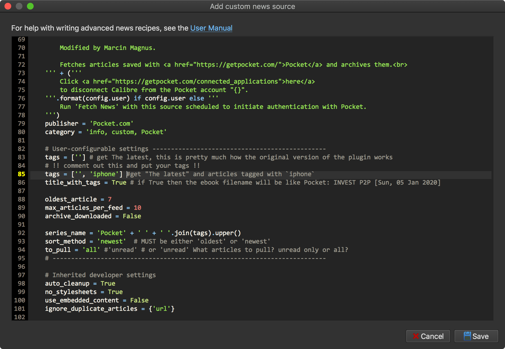
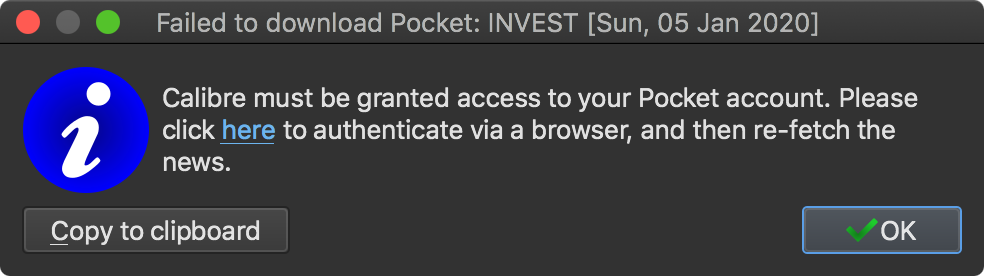
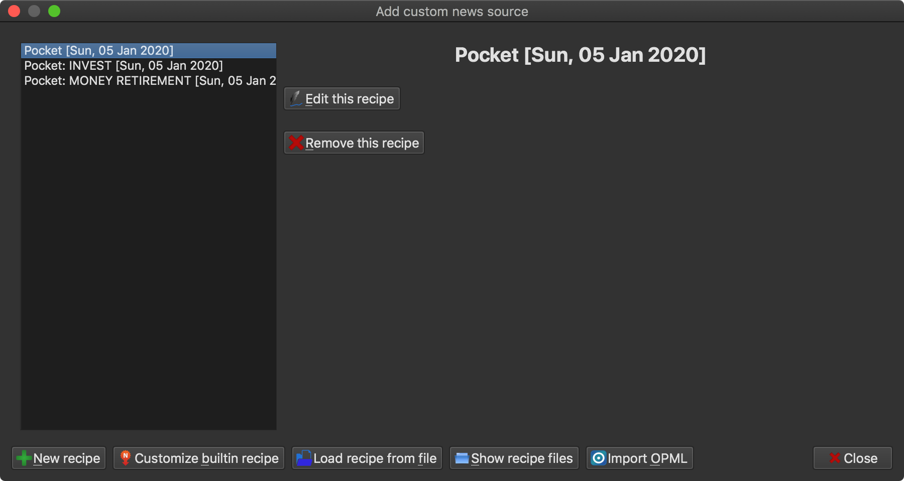

<div align="center">
	
<h1>
Pocket+ recipe for Calibre
</h1>

[](https://github.com/mmagnus/Pocket-Plus-Calibre-Plugin/releases) <span class="badge-paypal"><a href="https://www.paypal.me/MarcinMagnus" title="Donate to this project using Paypal"></a></span> 
<span class="badge-flattr"><a href="https://flattr.com/profile/mmagnus" title="Donate to this project using Flattr"></a></span>
</br></br>
<b>This plugin allows users to get their Pocket-ed articles with Calibre and send them as an e-book to their prefered e-book reader. You can schedule this process and every day get the freshest e-book with your Pocket-ed articles!</b>

There is also experimental version of this plugin: https://github.com/mmagnus/PocketX-Calibre-Plugin

</div>

Table of contents:

  * [Settings](#settings)
  * [Installation](#installation)
  * [Changelog](#changelog)
  * [Tips](#tips)
  * [Development](#development)
  * [Workflow](#workflow)
  
[Pocket](https://getpocket.com/), previously known as Read It Later, is an application and service for managing a reading list of articles from the Internet. The application allows the user to save an article or web page to the cloud for later reading. The article is then sent to the user's Pocket list (synced to all of their devices) for offline reading. Pocket removes clutter from articles and allows the user to adjust text settings for easier reading [Source](https://en.wikipedia.org/wiki/Pocket_%28application%29).

[Calibre](http://calibre-ebook.com/) is a free and open source e-book library management application developed by users of e-books for users of e-books. The programs also allows users to create own e-books and syncing with a variaty of e-book readers (e.g. Kindle, that's how I got the screenshots below) [Source](https://en.wikipedia.org/wiki/Calibre_%28software%29). Calibre has a plugin management system and ..

Follow the discussion at <https://www.mobileread.com/forums/showthread.php?t=270602>

If you have no idea where to start, take a look here <https://www.howtogeek.com/115178/how-to-convert-news-feeds-to-ebooks-with-calibre> this is an explantion how to use Calibre to send news to your Kindle.

This is a fork of the original plugin and a merge of a fix by [@dlo9](https://github.com/dlo9).

I modified the plugin to get an e-book including:

* the Untagged (more or less as the original version of the plugin)
* your content organized by Pocket tags!
* or, alternatively, your articles organized by the first level domain of the URL.

Now, you get **Untagged** and **The Sections created based on you Pocket tags**:

<table><tr><td></td><td></td><td></td></tr></table>

Or sections based on **domains** of URsL (great contribution from @alvaroreig):

<table><tr><td></td></tr></table>

This is a fork of the original 2011 Calibre ReadItLater plugin.

# Sections by domain

If you want to use the sections by domain functionality, you have to

* active the SECTIONS_BY_DOMAIN flag
* uncomment the tld import. For more details, check https://github.com/mmagnus/Pocket-Plus-Calibre-Plugin/pull/31 

# Settings

To change settings, click on:

	Fetch news -> Add custom news source -> Pocket (Edit this recipe)

and edit the Python code.



**TAGS** (list of strings or empty list: []) if [] (empty list) then the plugin will connect Pocket and fetch articles based on the configuration of the plugin.
        Next, the plugin will get tags of these articles and group them into sections in the final ebook.
        If TAGS has elements, e.g., TAGS = ['tag1', 'tag2'] then only these tags will be fetched from Pocket.

**TAGS_EXCEPTIONS** (list of strings or empty list: []) if [] (empty list) then the plugin will ignore it.
        If TAGS_EXCEPTIONS has elements, e.g., TAGS_EXCEPTIONS = ['tag3', 'tag4'] then the articles tagged with this tags will be ignored.
        That is, tag3 and tag4 won't appear as sections, and it's articles won't appear in the  "Untagged" section.
        This variable is meant to be used with TAGS = [], as it doesn’t make any sense to specify a tag both in TAGS and in TAGS_EXCEPTIONS.

**SECTIONS_BY_DOMAIN** If activated, the articles will be grouped by first level domain. This will override any
        tag configuration (that is: TAGS, TAGS_EXCEPTIONS, INCLUDE_UNTAGGED). This is because the recipe ignores duplicated
        articles, and therefore an article can't appear under a "real" (pocket) tag and under the fake tag with its domain.

**SECTIONS_BY_DOMAIN_USING_TLD** you can install TLD and use it to get domains, but this requires installed library in 
        a way that Calibre will see it (I had a huge problem to get this running @mmagnus), so there is a new
        way to get domain based on parsing URL, less sophisticated but more reliable (in my opinion @mmagnus)

**INCLUDE_UNTAGGED** (True or False) if True then put all fetched and untagged articles in the last section 'Untagged'.
        If False then skip these articles and don't create the section 'Untagged'. Bear in mind that if TAGS is populated ( e.g. TAGS = ['tag1', 'tag2']),
        INCLUDE_UNTAGED = True and other tags exist in Pokcet (e.g. tag3,tag4) then the Untagged section will include untagged articles 
        in Pocket AND articles tagged with tag3 and tag4. That behavior can be avoided using TAGS_EXCEPTION

**ARCHIVE_DOWNLOADED** (True or False) do you want to archive articles after fetching 

**MAX_ARTICLES_PER_FEED** (number) how many articles do you want to fetch for FEED (FEED could be also 
considered as TAG, so for each TAG you this value will be applied.

**SORT_METHOD** ('oldest' or 'newest') way how the articles are sorted

**OLDEST_ARTICLE** (number) fetch articles added (modified) in Pocket for number of days, 7 will give you articles added/modified in Pocket for the last week 
 
**TO_PULL** ('all' or 'unread') What articles to pull? unread only or all?

**TITLE_WITH_TAGS** (True or False) if True will the ebook filename will be like
        Pocket: INVEST P2P [Sun, 05 Jan 2020] for many tags this might be to long, if you make a single tag ebook this might be super fun!

**ALLOW_DUPLICATES** (True or False) if True articles that have multiple tags matching those defined in TAGS are duplicated in each matched tag
        Eg.: TAGS = ['tag1','tag2'] then article1 that has both tags will appear in both sections tag1 and tag2. 

# Installation
  
* Download files https://github.com/mmagnus/Pocket-Plus-Calibre-Plugin/archive/master.zip
* Go to Calibre, under the "Fetch News" drop down select "Add or edit a custom news source"
* Click "Load Recipe From File" and choose the Pocket.recipe file
* Edit the settings in the windows that will pop up, for example, set up tags (See Settings), click Save, then Close
* Click "Fetch News", the Custom you will find Pocket, change "Schedule for download" if you want
* Click "Download Now" to download now if you want.
* You will be asked to grant access to your Plugin, click on "here" (to be able to click you have to close "Schedule news download" by clicking "OK" or "Cancel" first)


(if the window disappears, it might be behind the main window of Calibre)

* When the access is granted, simply click of "Fetch News" again to start!

If you have any problem read more [at Pocket](https://help.getpocket.com/customer/portal/articles/361724-how-to-configure-calibre-with-pocket)

Report any issues here: https://github.com/mmagnus/Pocket-Plus-Calibre-Plugin/issues

# Changelog

* 210731 [v2.7.3] Replace tld with standard Python way (not as good as tld but works without extra package) if SECTIONS_BY_DOMAIN_USING_TLD = False
* 201122 [v2.6.3] With fix from @AkashPatel95 #26
* 200515 [v2.4.0] Auto tags! Automatically group articles into Sections based on Pocket's tags.
* 200514 [v2.3.x] Redesigned tags system, attempt to fix `sort_id` problem, move OLDEST_ARTICLE to the top
* 200104 Incorporate code from David Orchard (@dlo9, https://github.com/dlo9/calibre-recipes) to fix an issue with Pocket Authentication API
* 170503 Download all images from every article by Stefan Wagner (@bompo)
* 170503 Decide what to pull (all vs unread)
* 170502 `Pocket + [Mon, 05 Dec 2016]`
* 160817 Add links to articles
* 160205 Modified version of the plugin to get (1) The latest (more or less as the original version of the plugin) (2) and your content organized by tags! 

# Tips

1. Don't forget that you can have multiple modified recipes and schedule each of them independently.



2. You can also take a look here if you want someone else to send your articles for you, so you don't have to have access to your computer. Both services were tested by me and they can be recommended!

- https://p2k.co
- https://www.crofflr.com/#/home

# Development
Links on development of recipes:

* https://manual.calibre-ebook.com/news.html
* https://manual.calibre-ebook.com/news_recipe.html
* https://manual.calibre-ebook.com/creating_plugins.html#more-plugin-examples

The default Calibre plugin is here https://github.com/kovidgoyal/calibre/blob/master/recipes/readitlater.recipe

    calibre-debug --paths --gui-debug ~/Desktop/calibre.txt

# ToDo
* Properly document how to automate this recipe with ebook-convert and calibre-smtp
* Refactor the code that fetch the tags from pocket.
* lazy load "from tld import fld"

# Workflow
(some potential workflow that @mmagnus is using at the moment)

**MY CURRENT WORKFLOW**

I often (each day or every second day) send new things [1] from my Pocket to my Kindle. When I research some particular topic I use tags to fetch only articles related to the given topic, e.g., “python testing”, and then I have a nice book only on that topic. For each of this type of books you can just copy paste this plugin and change the variables at the top of the file to have a few lines of action in your workflow.

```python
# [1]
TAGS = [] 
ARCHIVE_DOWNLOADED = True
MAX_ARTICLES_PER_FEED = 100
SORT_METHOD  = 'newest'
TO_PULL = 'unread' 
	
# [2]
TAGS = ['python testing']
ARCHIVE_DOWNLOADED = True
MAX_ARTICLES_PER_FEED = 100
SORT_METHOD  = 'newest'
TO_PULL = 'all'
```

**ANOTHER WORKFLOW**

The new AUTOTAGS feature has the ability to automatically generate the ebook without explicitly specifying the tags in the recipe. However, in my workflow there are certain articles that I save to Pocket but are not meant to be read in Kindle. They might have a lot of links, or are involved in software development and I want to read them as I code, or any other reason. In that context, the variable TAGS_EXCEPTIONS is very useful. I can use a tag like "nokindle" and guarantee that these articles won't be downloaded (and archived):

```python
# [1]
TAGS = []
TAGS_EXCEPTIONS = ['nokindle']
ARCHIVE_DOWNLOADED = True
MAX_ARTICLES_PER_FEED = 100
SORT_METHOD  = 'newest'
TO_PULL = 'unread' 
```

**AUTOMATED [no Calibre]**

One thing, this plugin needs that the Calibre is open and running. If you want someone else to send your articles for you, you can use these services. This is pretty cool because you don't have to have access to your computer. Both services were tested by me and I can recommended them! At the moment I prefer to be in 100% control of what and when is sent to my Kindle so I use only the plugin from this repo.

https://p2k.co https://www.crofflr.com/#/home 

**PUSH TO KINDLE NOW AS ONE FILE**

Sometimes I want to read something NOW or as a single e-book and I don't want to go through Calibre, then I use these plugins to push an article directly to Kindle. 

https://www.fivefilters.org/push-to-kindle/ (for Safari, Chrome, Firefox) https://www.amazon.com/gp/sendtokindle/chrome (for Chrome)
