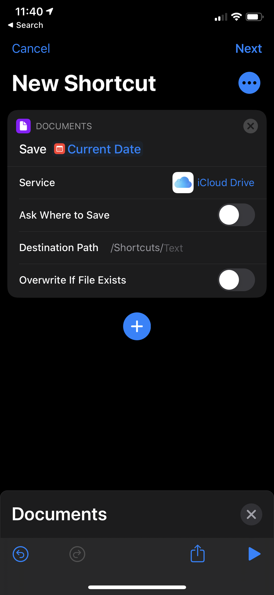
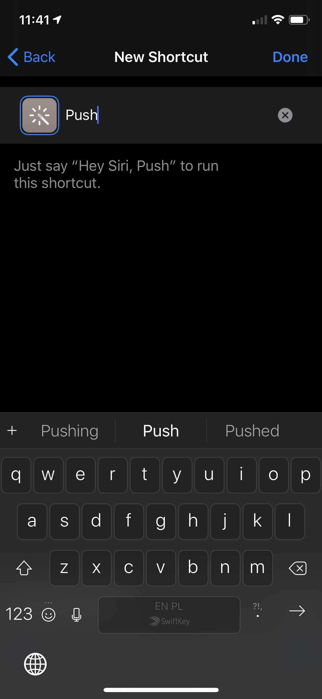
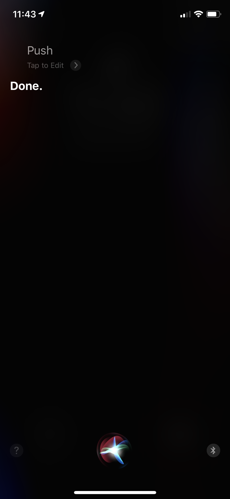
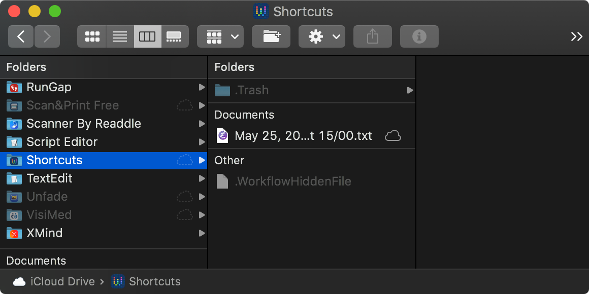

Push
-------------------------------------------------------------------------------

## Create a Shortcut to create a file in given folder

Here I use Shortcut for iPhone, the trigger phrase is "Push".

<table><tr><td></td><td></td><td></td></tr></table>

## This Shortcut will make a file in iCloud/Shortcuts

## This new file will be detected by this script and my calibre push script will be executed

    * * * * * /Users/magnus/workspace/Pocket-Plus-Calibre-Plugin/push/push-crontab.sh
    # this is just fancy wrapper to get cron run every 5 s
